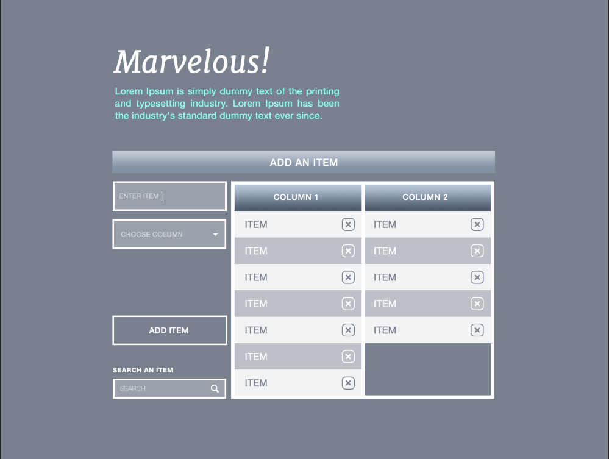

# Epic Games Interview Assessment
##### Author: Yun Hao
##### Assigned by: H8tch Innovations

### Goal

Replicate the following photoshop snap shot:

 

With the following requirements: 

<pre>
    “Add an item” area functionality:
        - Adding an item to a column
            - The user enters an item in the text box
            - The user selects a column from the dropdown
            - The user clicks items “Add Item” and the item is added to the correct column
        - Deleting an item
            - The user clicks the “x” by an item and it is removed from the column
        - Searching
            - As the user enters text in the search box, both columns are filtered to display only items matching the text entered thus far
    The page should be responsive 
    There is no mockup for responsive, use your intuition here
</pre>

### Installation Guide
<pre>
npm install && npm run start
</pre>

The project should then be running on default local port 

[localhost:3000](localhost:3000)